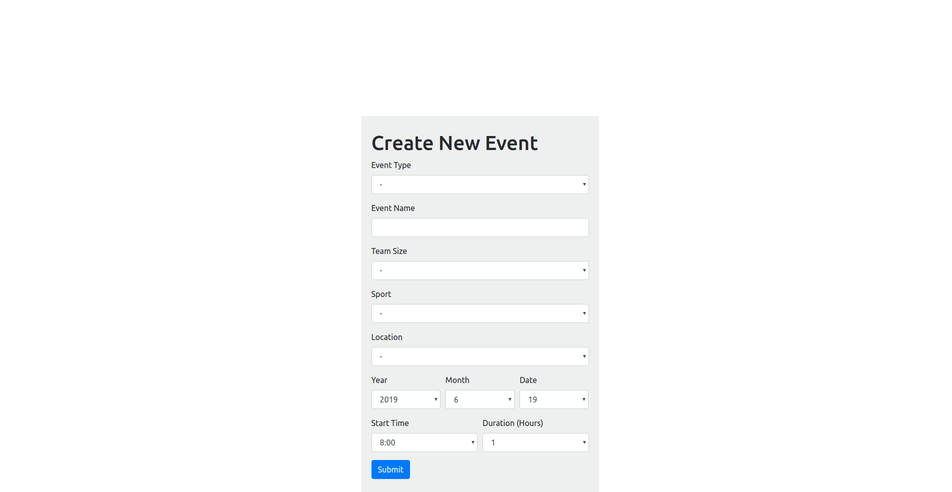
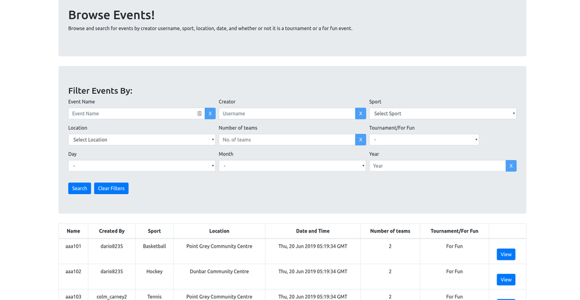
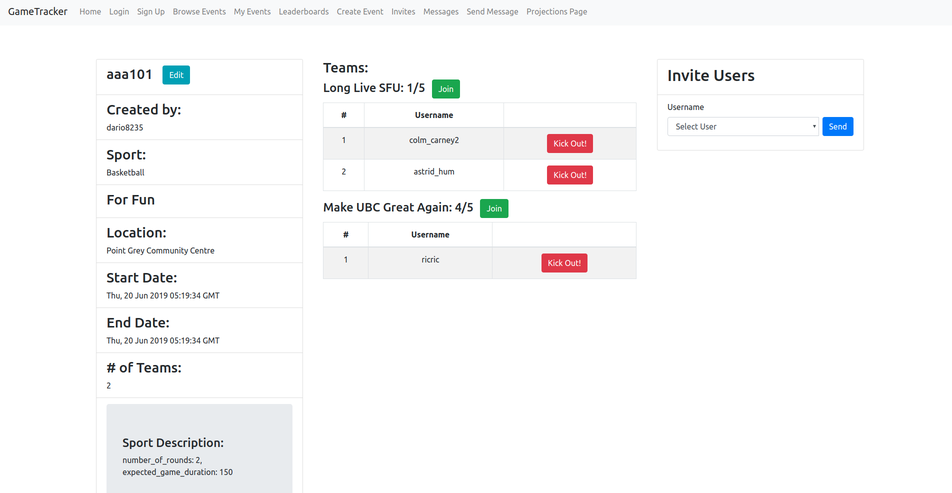
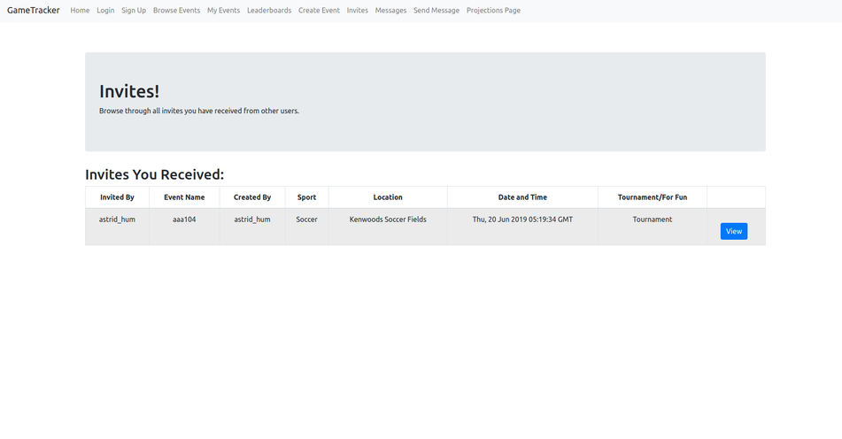
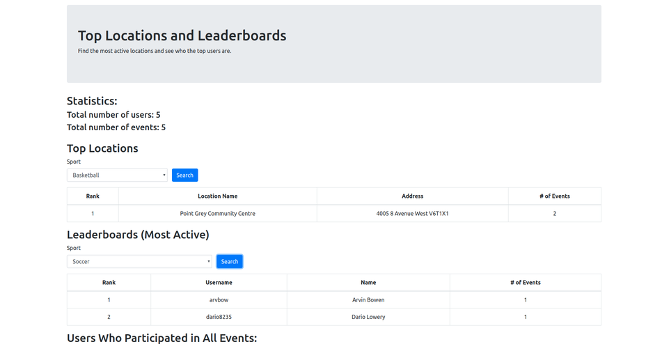
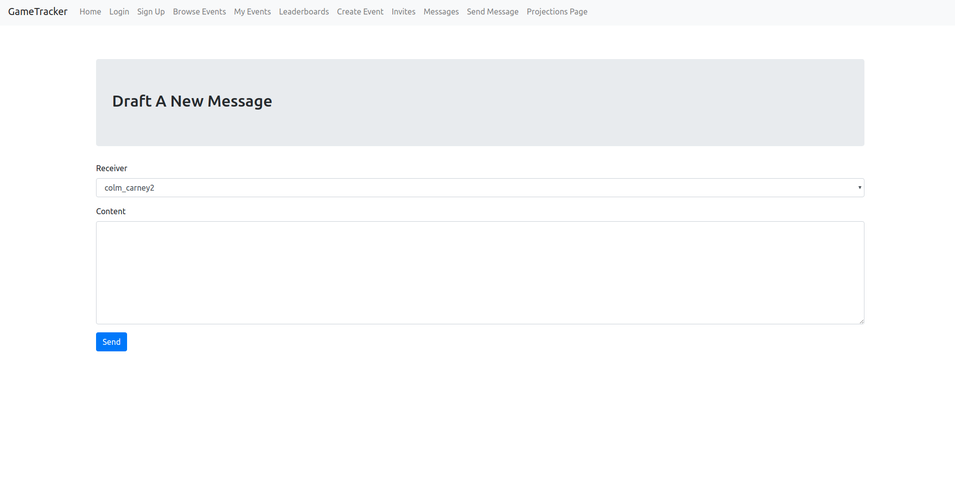
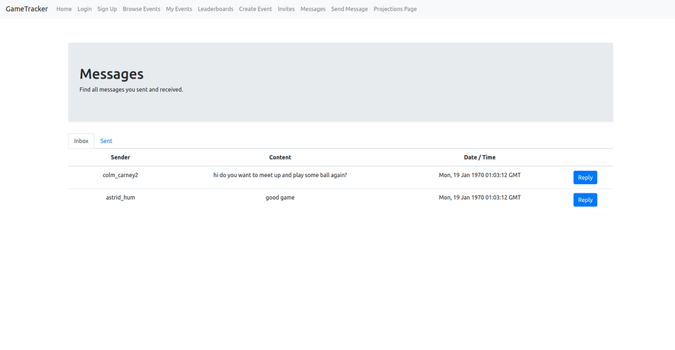

## GameTrack
GameTrack is a web platform where active people can sign up, create sports events, and join local sports events. Users can also message others on the platform and invite them to events. The app offers locations for the users to book and host events, so they wouldn’t have to worry about finding a venue themselves.

## Motivation
This is project is developed for the term assignment for the class CPSC 304 (Introduction to Relational Database) offered at the University of British Columbia. It taught our team the design and development process for a modern web app

## Technical Stack
### Frontend
  [React](https://reactjs.org/)
### Backend
  [Java with Spring Framework](https://spring.io/)  
  [MySQL](https://www.mysql.com/)

## Installation
### prerequisites
- Node, NPM, Yarn
- Docker
- Maven

to set up the development env  
first, we will set up the React app 
```
cd app
npm install
yarn install
```

next, we will run a MySQL docker container with custom tables pre-loaded
```
cd ..
bash docker.sh
```

lastly, we will run the Java back-end
```
cd gametrack
mvn spring-boot:run
```

## Screens
  
  
  
  
  
  
  
